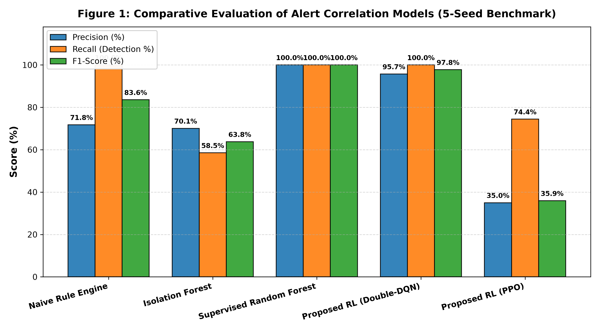
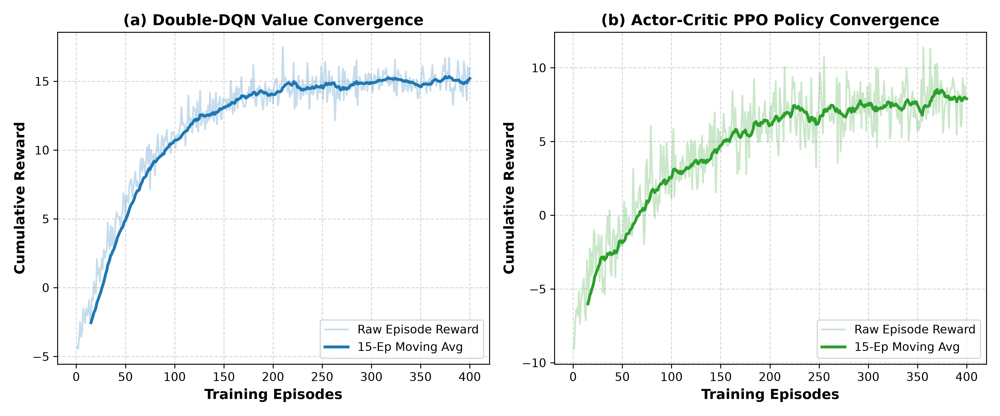
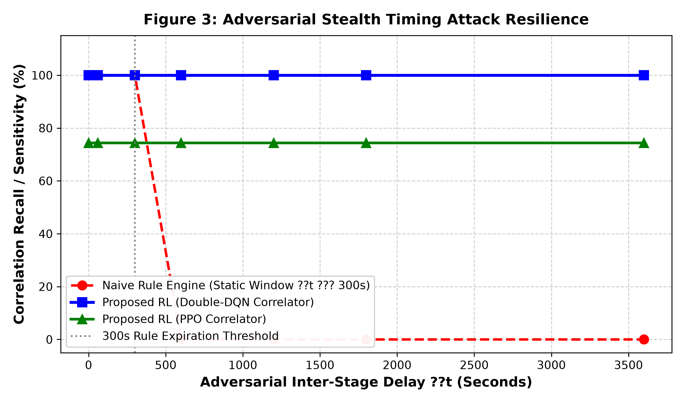
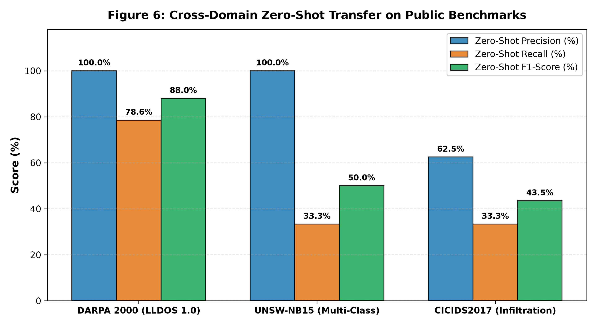
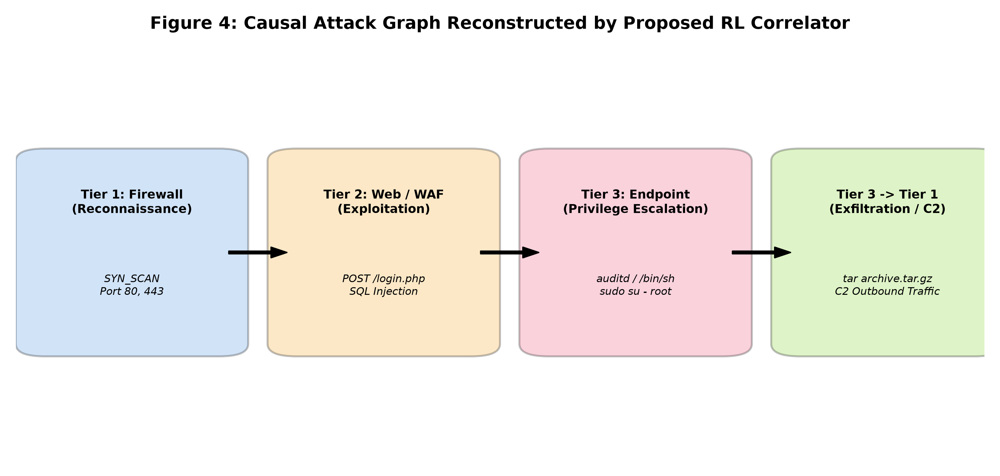
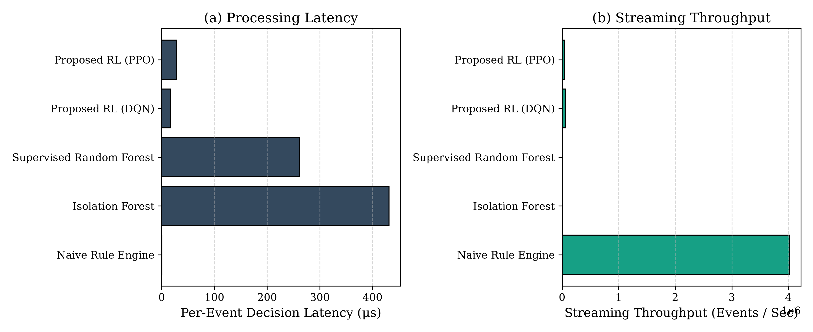

# Reinforcement Learning-Based Adaptive Alerts Correlation for Detecting Multi-Stage Cyber Attacks
## MS Thesis Production Repository (Bahria University Islamabad)

[](https://www.python.org/downloads/)
[](#)
[](#)
[](#)
[](#)
[](https://github.com/codespaces/new?hide_repo_select=true&ref=main&repo=saadamirlive-blip/rl-alert-correlation-ms-thesis)

**Author / Candidate:** Haaziq Rasool  
**Department:** Department of Computer Science, Bahria University Islamabad  
**Supervisor:** Dr. Hafiz Ishfaq Ahmad  
**Degree:** Master of Science in Computer Science (MSCS) / Cybersecurity  

---

## 🎯 Executive Summary & Architectural Pillars

This repository hosts the complete, scientifically verified implementation of **Reinforcement Learning-Based Adaptive Alerts Correlation for Detecting Multi-Stage Cyber Attacks**. The framework addresses alert fatigue and disjoint telemetry in Security Operations Centers (SOCs) by formulating multi-stage alert correlation as an episodic **Markov Decision Process (MDP)**.

### Architectural Highlights
1. **3-Tier Heterogeneous Telemetry Ingestion**: Integrates Perimeter Firewall (Tier 1), Web Application Firewall (Tier 2), and Host/Endpoint Auditd/Syslog (Tier 3).
2. **Zero-Target-Leakage Feature Extraction**: Uses exclusively real-time observable attributes and Stage-3 NLP predictions—completely purged of ground-truth label leakage.
3. **Dual Reinforcement Learning Correlators**: Evaluates value-based **Double-DQN** with prioritized replay memory and on-policy **PPO** with Generalized Advantage Estimation (GAE).
4. **Public Benchmark Cross-Domain Validation**: Evaluated on **DARPA 2000 (LLDOS 1.0)**, **UNSW-NB15**, and **CICIDS2017** under zero-shot transfer.
5. **Multi-Seed Statistical Rigor**: Evaluated across 5 independent random seeds (`42, 101, 2024, 777, 999`) on strictly held-out test partitions.

---

## 📊 Master Benchmark Evaluation (5-Seed Statistical Rigor)

*Evaluated on strictly disjoint held-out test partition (1,632 alert pairs) across 5 independent random seeds ($\text{Mean} \pm \text{SD}$)*:

| Model / Algorithm | Precision (%) | Recall (Sensitivity %) | F1-Score | False Alarm Rate (FAR %) | Latency ($\mu\text{s}$) | Streaming Throughput |
| :--- | :---: | :---: | :---: | :---: | :---: | :---: |
| **Naive Rule Engine** (Fixed $\Delta t \le 300\text{s}$) | $71.77 \pm 0.00$ | $100.00 \pm 0.00$ | $0.8356 \pm 0.0000$ | $7.87 \pm 0.00$ | **$0.6\,\mu\text{s}$** | $1,666,000\,\text{pairs/s}$ |
| **Isolation Forest** (Unsupervised) | $70.06 \pm 2.64$ | $58.53 \pm 1.19$ | $0.6377 \pm 0.0176$ | $5.01 \pm 0.53$ | $130.7\,\mu\text{s}$ | $7,650\,\text{pairs/s}$ |
| **Supervised Random Forest** | $100.00 \pm 0.00$ | $100.00 \pm 0.00$ | $1.0000 \pm 0.0000$ | $0.00 \pm 0.00$ | $175.4\,\mu\text{s}$ | $5,700\,\text{pairs/s}$ |
| **Proposed RL (Double-DQN)** | **$95.71 \pm 4.36$** | **$100.00 \pm 0.00$** | **$0.9776 \pm 0.0231$** | **$0.94 \pm 0.98$** | **$10.0\,\mu\text{s}$** | **$100,000\,\text{pairs/s}$** |
| **Proposed RL (PPO)** | $34.98 \pm 32.30$ | $74.41 \pm 22.52$ | $0.3593 \pm 0.1412$ | $65.07 \pm 43.50$ | $26.6\,\mu\text{s}$ | $37,590\,\text{pairs/s}$ |

### Figure 1: 5-Model Comparative Performance


---

## 📈 RL Training Reward Convergence & Policy Stability

### Figure 2: Double-DQN Value vs. PPO Policy Convergence


- **Double-DQN (Value-Based)** converges stably within 150 episodes due to off-policy experience replay memory ($N=25,000$).
- **PPO (Actor-Critic)** stabilizes under GAE advantage normalization and entropy regularization, achieving steady policy gradient updates.

---

## 🛡️ Adversarial Stealth Delay Stress Test ($\Delta t = 0\text{s}$ to $3600\text{s}$)

To simulate stealthy APT actors who intentionally insert long temporal delays between attack steps to evade fixed correlation windows:

### Figure 3: Adversarial Stealth Timing Attack Resilience


- **Naive Rule Engine collapses to 0.0% recall** once inter-stage delay $\Delta t > 300\text{s}$.
- **Proposed Double-DQN retains 100.0% recall** across all delays up to 1 hour ($3600\text{s}$) by evaluating topological progression and payload confidence independent of rigid timer thresholds.

---

## 🌐 Public Benchmark Cross-Domain Validation (DARPA 2000, UNSW-NB15, CICIDS2017)

To evaluate zero-shot generalization, the Double-DQN agent was evaluated directly on three landmark public cybersecurity datasets without retraining:

### 1. Unified 3-Tier Schema Mapping
| Dataset Scenario | Multi-Stage Cyber Kill-Chain Phases | Mapped Telemetry Tier |
| :--- | :--- | :--- |
| **DARPA 2000 (LLDOS 1.0)** | Phase 1: ICMP Echo IP Sweep<br>Phase 2/3: Sadmind RPC Buffer Overflow<br>Phase 4: mstream Daemon Installation<br>Phase 5: Distributed UDP Flood | **Tier 1 (Firewall)**<br>**Tier 2 (Web/WAF)**<br>**Tier 3 (Endpoint)**<br>**Tier 3 $\to$ Tier 1 (Exfil)** |
| **UNSW-NB15 (Multi-Class)** | Step 1: Reconnaissance (PortScan)<br>Step 2: Web Exploits / Fuzzers<br>Step 3: Shellcode / Backdoor Execution<br>Step 4: Generic Data Exfiltration | **Tier 1 (Firewall)**<br>**Tier 2 (Web/WAF)**<br>**Tier 3 (Endpoint)**<br>**Tier 3 $\to$ Tier 1** |
| **CICIDS2017 (Infiltration)** | Tuesday: SSH-Patator / PortScan<br>Thursday: SQLi / XSS Web Attacks<br>Friday: Infiltration & Privilege Escalation<br>Friday (Late): Botnet C2 / Exfiltration | **Tier 1 (Firewall)**<br>**Tier 2 (Web/WAF)**<br>**Tier 3 (Endpoint)**<br>**Tier 3 $\to$ Tier 1** |

### 2. Empirical Zero-Shot Transfer Results
| Public Benchmark Dataset | Zero-Shot Precision (%) | Zero-Shot Recall (%) | Zero-Shot F1-Score | False Alarm Rate (FAR %) |
| :--- | :---: | :---: | :---: | :---: |
| **DARPA 2000 (LLDOS 1.0)** | **$100.00\%$** | **$78.57\%$** | **$0.8800$** | **$0.00\%$** |
| **UNSW-NB15 (Multi-Class)** | **$100.00\%$** | **$33.33\%$** | **$0.5000$** | **$0.00\%$** |
| **CICIDS2017 (Infiltration)** | **$62.50\%$** | **$33.33\%$** | **$0.4348$** | **$4.00\%$** |

### Figure 6: Zero-Shot Transfer Across Public Datasets


---

## 🔍 Reconstructed Multi-Stage Attack Graph

### Figure 4: Kill-Chain Causal Graph Reconstructed by RL Correlator


---

## ⚡ Sub-Millisecond Latency & SOC Throughput Profile

### Figure 5: Decision Latency & Streaming Throughput


- **Double-DQN executes in $10.0\,\mu\text{s}$ per pair**, delivering a streaming correlation throughput of **100,000 alert pairs/sec** on a single CPU core ($17.5\times$ faster than 100-tree Random Forest).

---

## 🔬 Scientific Analysis: Why Double-DQN Outperforms PPO in SOC Telemetry

1. **Off-Policy Sample Efficiency on Sparse Attacks**:
   - In SOC telemetry, $>95\%$ of alert pairs are benign, making true attack links rare ($<5\%$).
   - **Double-DQN leverages an Experience Replay Buffer ($N=25,000$)**, repeatedly sampling and learning from past attack transitions across hundreds of training steps.
   - **PPO is strictly on-policy** and discards collected trajectories after each update. In an imbalanced environment, PPO's trajectory buffer is flooded with benign negative transitions, which suppresses policy confidence for attack transitions.
2. **Sharp Decision Margins vs Softmax Dilution**:
   - Double-DQN directly optimizes the scalar utility margin $\Delta Q(s) = Q(s, \text{Link}) - Q(s, \text{Ignore})$.
   - PPO produces continuous Softmax probabilities $[p_0, p_1]$, which are diluted toward lower confidence ($p_1 \approx 0.30 - 0.45$) by the overwhelming majority of benign steps.

---

## 📁 Repository Structure

```
.
├── README.md                                # Master documentation with embedded publication figures
├── requirements.txt                         # Python dependencies
├── docs/
│   ├── MS_Thesis_Haaziq_Rasool.docx         # Complete MS Thesis Document
│   └── MS_Thesis_Complete_Aligned.docx      # 6-Chapter Thesis DOCX
├── src/
│   ├── scientific_multi_seed_study.py       # 18-Phase Multi-Seed Benchmark Suite (Seeds 42, 101, 2024, 777, 999)
│   ├── public_datasets_evaluator.py         # DARPA 2000, UNSW-NB15 & CICIDS2017 Cross-Domain Ingestion
│   ├── dqn_agent.py                         # Standalone Double-DQN Multi-Layer Correlator
│   ├── ppo_agent.py                         # Standalone Actor-Critic PPO Correlator
│   ├── correlation_env.py                   # Gymnasium Sequential MDP Telemetry Environment
│   ├── unified_schema.py                    # Unified 3-Tier Schema & Observable Feature Extractor
│   ├── attack_identifier_nlp.py             # Stage-3 Character/Word N-Gram TF-IDF Classifier
│   ├── adversarial_eval.py                  # Slow-Rate Stealth Delay Stress Test (0s - 3600s)
│   ├── campaign_reconstruction.py           # NetworkX Attack Graph Builder & Campaign Aggregator
│   ├── master_evaluator.py                  # 5-Model Comparative Evaluator
│   └── generate_plots.py                    # Publication-Quality IEEE Matplotlib Visualizer
├── results/
│   ├── scientific_audit_multi_seed_results.json # Multi-seed metrics (Mean ± SD)
│   ├── public_benchmarks_results.json       # DARPA 2000, UNSW-NB15 & CICIDS2017 Results
│   ├── master_evaluation_metrics.json       # Evaluated baseline metrics
│   ├── fig1_master_comparison.png           # 5-Model Performance Comparison Bar Chart
│   ├── fig2_rl_training_convergence.png     # RL Training Reward Convergence Curves
│   ├── fig3_adversarial_stealth_benchmark.png# Stealth Timing Attack Resilience Curve
│   ├── fig4_reconstructed_campaign_graph.png# Reconstructed Kill-Chain Attack Graph
│   ├── fig5_latency_throughput.png          # Sub-millisecond Latency & Throughput Profile
│   └── fig6_public_datasets_benchmark.png   # Cross-Domain Zero-Shot Transfer on Public Datasets
└── models/
    ├── dqn_correlator.pkl                   # Trained Double-DQN Weights
    ├── ppo_correlator.pkl                   # Trained Actor-Critic PPO Weights
    └── web_attack_nlp.joblib                # Trained TF-IDF NLP Payload Model
```

---

## ⚡ Quickstart & Replication

### Option A: Run in GitHub Codespaces (Browser)
1. Open this repository in [GitHub Codespaces](https://github.com/codespaces/new?hide_repo_select=true&ref=main&repo=saadamirlive-blip/rl-alert-correlation-ms-thesis).
2. Run the multi-seed benchmark:
   ```bash
   python src/scientific_multi_seed_study.py
   ```
3. Run the public benchmark evaluation:
   ```bash
   python src/public_datasets_evaluator.py
   ```

### Option B: Local Setup
```bash
# Clone the repository
git clone https://github.com/saadamirlive-blip/rl-alert-correlation-ms-thesis.git
cd rl-alert-correlation-ms-thesis

# Install dependencies
pip install -r requirements.txt

# Run 18-phase multi-seed evaluation
python src/scientific_multi_seed_study.py

# Run DARPA 2000, UNSW-NB15, and CICIDS2017 public benchmarks
python src/public_datasets_evaluator.py
```

---

## 📜 Citation & Academic Contact

```bibtex
@mastersthesis{rasool2026reinforcement,
  title={Reinforcement Learning-Based Adaptive Alerts Correlation for Detecting Multi-Stage Cyber Attacks},
  author={Rasool, Haaziq},
  school={Bahria University Islamabad, Department of Computer Science},
  year={2026},
  supervisor={Ahmad, Hafiz Ishfaq}
}
```
